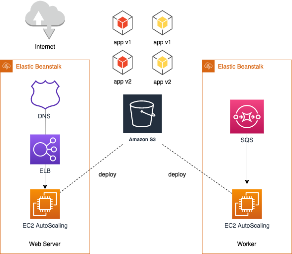
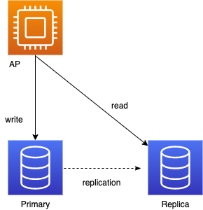

## PaaS
### 10.27.2020    

---

Platform as a Serviceの略です。

---

システム開発に必要なミドルウェア、データベース管理システム、プログラミング言語、WebサーバーOSなどのソフトウェア一式を提供してくれます。  
賃貸契約して家具が揃ってる感じ？

---

#### 主なメリット
- 複雑な開発環境を自分で整える手間がなくなることです。開発に必要となる言語や管理システム、OSといった基盤が提供されます。
- ソースコードやデータベース定義を構築するだけでOK！
- 構築自体のコストは皆無

---

#### 主なデメリット
- 利用できる言語や開発環境が、PaaSが提供するものに限られます。
- ベンダが提供するレイヤの操作(OS周りの操作とか)はできなかったり制約があったりします。
- オンプレ慣れしていると最初使い辛く感じるかもしれません。

---

#### クラウドベンダ各社の主なサービス
プログラム動作環境が整ったサービス

| ベンダ | サービス名 |
| --- | --- |
| AWS | ElasticBeanStalk |
| Azure | App Service |
| GCP | App Engine |

---

突然ですが、各社のサービスの説明をする前にAPのデプロイについて説明します。

---

皆さん本番環境でどうやってデプロイしていますか？  
サービス停止時間中にデプロイ？  
片系ずつ閉塞してデプロイ？

---

あんまり聴き慣れないかもしれませんが、色んなデプロイ方式があったりします。  
PaaSサービスでは様々なデプロイ機能が用意されているので最初に説明しておきます。

---

今回紹介するのは以下です。(一部です)

| デプロイ方式 |
| --- |
| ローリングアップデート |
| ブルーグリーンデプロイ |
| カナリアリリース |

[参考サイト](https://garafu.blogspot.com/2018/11/release-strategy.html?m=1)

---

### ローリングアップデート
- 稼動中のAPに対して一定数ずつ新しいAPに入れ替えていく方式
- オンラインから切り離してAPを更新してオンラインに戻す方法（インプレース）や
- 環境毎新しくして古い環境は削除してしまう方法（イミュータブル）がある。

---

### ブルーグリーンデプロイ
- 新しいAPを搭載したサーバ（グリーン）を旧サーバ（ブルー）とは別にデプロイして新環境へ切り替える方式

---

### カナリアリリース
- 稼働中のAPの一部を新APへ入れ替えて処理の一部（少量）を新APへ流して検証する方式

---

では、サービスを紹介していきます。

---

#### AWS
### Elastic Bean Stalk

>>>

EBSはEC2に+αした状態で提供されるイメージです。

>>>

EBSのタイプは大きく分けて二種類あります。
- Webサーバ環境
- Worker環境 → SQSというQueueサービスと連携するバッチ

>>>

#### 主な特徴というか機能
- APデプロイの自動化
- APバージョンの管理（異なるバージョンを別環境にデプロイ可能）

>>>

#### 提供しているデプロイ方式（前に挙げたやつ）
- ローリングアップデート
- ブルーグリーンデプロイ
- 他にも単一インスタンス用のデプロイ方式が提供されています。

>>>

構成図にするとこんな感じ  

>>>

- IaaSの紹介で挙げた作成済みのVPC上にデプロイすることも可能です。
- デフォルトではVPCを指定しないようになっていますが、これだとVPCとは別のエリアに作られる。
- 設定を行うことでDBなど他のサービスと連携が可能です。

>>>

#### サポートしているランタイムは以下(2020/10時点)
- Docker
- Go
- Java
- Tomcat
- .NET
- Node.js
- PHP
- Ruby

>>>

#### 参考サイト

[AWS 開発者ガイド](https://docs.aws.amazon.com/ja_jp/elasticbeanstalk/latest/dg/Welcome.html)  
[AWS BlackBelt](https://d1.awsstatic.com/webinars/jp/pdf/services/20170111_AWS-Blackbelt-Elastic-Beanstalk.pdf)

---

#### Azure
### App Service

>>>

- サービスの役割は前述したEBSと似ています。
- バッチというよりはWebAP用といったイメージです。

>>>

複数の利用プランが用意されており、プランによって負荷に応じたオートスケール、ブルーグリーンデプロイ、VNetへの構築といった利用できる機能、リソースが異なります。  

>>>

下のプランほど価格が高いです。

| プラン |
| --- |
| Free |
| Share |
| Basic |
| Standard |
| Premium |
| Isolated |

>>>

#### 提供されるデプロイ方式
- ステージングスロット（ブルーグリーンデプロイ）
- Standardプラン以上より利用可能

>>>

#### サポートしているランタイムは以下(2020/10時点)
- Docker
- Java
- Tomcat
- .NET
- ASP.NET
- Node.js
- PHP
- Ruby

>>>

#### 参考サイト
[Microsoft document](https://docs.microsoft.com/ja-jp/azure/app-service/)

---

#### GCP
### App Engine

>>>

- これまた本サービスの役割は他のクラウドベンダと同様です。
- WebAPだけでなく、Cronjob（Batch）も実行できます。

>>>

#### 大きく二つのタイプがあります。
- スタンダード環境
- フレキシブル環境

>>>

- スタンダード環境は安価で軽量だが、サンドボックスと呼ばれる独立したエリアで実行されます。
- フレキシブル環境はVM（ComputeEngine）上のdockerコンテナ内で実行されランタイムの変更が可能など比較的柔軟です。機能数も多いです。

>>>

#### 提供されるデプロイ方式
- トラフィック分割（カナリアリリース）※スタンダードのみ
- トラフィック移行（ブルーグリーンデプロイ）

>>>

#### サポートしているランタイムは以下(2020/10時点)
環境によりサポートするバージョンは異なったりします。
- Go
- Java
- python
- Node.js
- PHP
- Ruby
- .NET（フレキシブルのみ）
- カスタムランタイム（フレキシブルのみ）　　
　→Dockerfileを作成することでHTTPリクエストを扱える全ての言語・ランタイムを扱える

>>>

#### 環境の選び方
- コスト＆運用負荷減らしたいならスタンダード
- 柔軟性を残しつつ運用負荷減らしたい（スタンダードには劣る）ならフレキシブル

>>>

#### 参考サイト
[GCP document](https://cloud.google.com/appengine/docs?hl=ja)

---

次はDBサービスを紹介していきます。  
その前にDBについて少し学んでおきます。  

---

みなさん普段どんなDB使っていますか？  

---

今回は以下二つを説明します。

| 種類 |
| --- |
| リレーショナル |
| NoSQL |

---

#### リレーショナル
- 表形式（行と列）でデータを持つ
- SQLにより、データへの問い合わせが可能
- アトミック性、一貫性、分離性、および耐久性 (ACID) の特性を持つ
- OLTP(オンライントランザクション処理)とOLAP(オンライン分析処理)に向いている

---

#### NoSQL
- key-value、document(JSONとか)、インメモリなど表（構造型）ではなく非構造型データを持つことができる。
- リレーショナルとは異なり一貫性の制限を緩和することでパフォーマンスを向上させている。

---

クラウドでは両方のデータベースサービスを提供しています。

---

### リレーショナルDBサービス

| ベンダ | サービス名 |
| --- | --- |
| AWS | RDS |
| Azure | SQL Database |
| GCP | Cloud SQL/Cloud Spanner |

---

ベンダによってサポートしているDBが異なります。  
書いてないものもあります。  

| DB | RDS | SQL Database | Cloud SQL | Cloud Spanner |
| --- | --- | --- | --- | --- |
| Mysql | ○ | ○ | ○ | × |
| PostgresSQL | ○ | ○ | ○ | × |
| SQLServer | ○ | ○ | ○ | × |
| Oracle | ○ |　× | × | × |

---

### マネージドDBサービスの良いところ
- 構築が簡単！
- 冗長化やバックアップといった高可用性機能がサポートされている
- リードレプリカによる負荷分散が可能
- 容量の自動拡張が可能  
  *逆にOracleのRMANなどDB自体のバックアップ機能がサポートされない場合がある

---

### リードレプリカ
- Primaryインスタンスとは別にReplicaインスタンスを作成して照会処理のみ実行して負荷分散します。  
- Primary障害時にはReplicaをPrimaryへ昇格させることができます。
- PrimaryからReplicaへのレプリケーションラグが発生することがあります。

---

### NoSQL

| ベンダ | サービス名 |
| --- | --- |
| AWS | DynamoDB / ElastiCache / DocumentDB etc.. |
| Azure | CosmosDB / Cache for Redis|
| GCP | FireStore / Bigtable / Memorystore |

---

key-value、documentなどタイプ別にサービスが分かれています。  

---

### サーバレスについて
- これまでに紹介したDBはサーバリソースを確保するものとサーバレスのタイプがあります。
- リソース確保は時間で課金されサーバレスは使った容量、トランザクション量により課金されます。
- サーバレスはコントロールしづらい、学習コストがかかる、ベンダーロックインしやすいと言われているので必ずしもサーバレスが良いわけではない。

---

#### 参考サイト
この辺り見るとサービス毎の特性がさらっとわかります。
[AWS](https://aws.amazon.com/jp/products/databases/)  
[Azure](https://azure.microsoft.com/ja-jp/product-categories/databases/)  
[GCP](https://cloud.google.com/products/databases?hl=ja)

---

紹介しませんが、クラウドのDBサービスに関連してデータベースの移行サービスも充実しています。  
[AWS Database Migration Service](https://aws.amazon.com/jp/dms/)  
[Azure Database Migration Service](https://azure.microsoft.com/ja-jp/services/database-migration/)  
[GCP](https://cloud.google.com/solutions/database-migration?hl=ja#section-2)  
